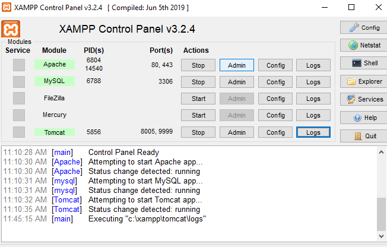
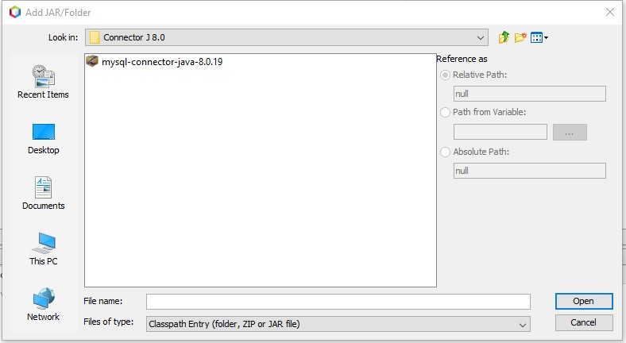

# Required programms:
* [XAMPP](https://www.apachefriends.org/index.html) *for server and database*
* [Postman](https://www.postman.com/) *for requests*
* [DB connector](https://drive.google.com/file/d/1fqU5b9HNUzEqTEixwwc2Vh0YlXFx42wp/view?usp=sharing) *for db connection*
 # Steps
 1. Download project [zip](https://github.com/Picenkaa/Java-task/archive/master.zip) or  `$ git clone https://github.com/Picenkaa/Java-task.git`
 2. Start Apache MySql and Tomcat.
  
 3.Add connector to libraries. *(not in memory because connected automatically creates database and table with variables)*

4. `ctrl+11` or run on web.
# RESTful methods(use postman)
* try passing parameters through postman (post)  `value = "/add_{address}_{owner}_{size}_{market_value}_{property_type}", method = RequestMethod.POST`
[example](http://localhost:9999/WS_full/add_Vilniaus_Steponas_30_20000_butas)
* [display list](http://localhost:9999/WS_full/)
* delete using address `value = "/del_{Adress}", method = RequestMethod.DELETE` [example](http://localhost:9999/WS_full/del_Vilniaus)
* edit market value through address `value= "/upd_{address}_{new_mareket_value}", method = RequestMethod.PUT` [example](http://localhost:9999/WS_full/upd_Vilniaus_30000)
* endpoint `value = "/tax_{Owner}", method = RequestMethod.GET` [example](http://localhost:9999/WS_full/tax_Steponas)
# Comments
TODO
 
